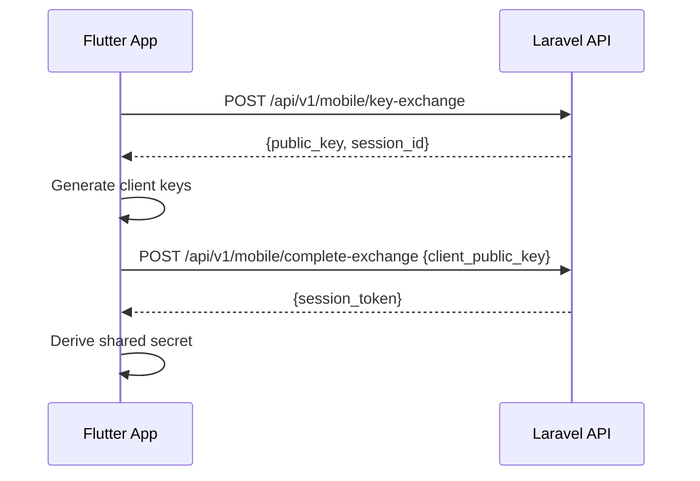
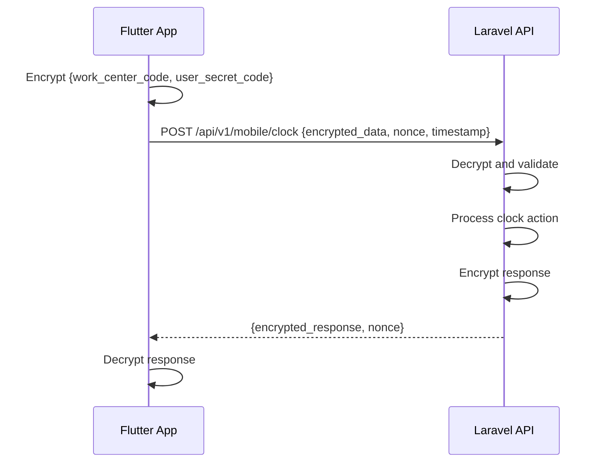

# 🔐 Estrategia de Encriptación para API Móvil CTH

## 📋 Objetivo
Implementar un sistema de seguridad robusto para proteger las comunicaciones entre la app móvil Flutter y la API CTH, asegurando que los códigos de centro de trabajo y códigos secretos de usuarios no puedan ser interceptados o comprometidos.

## 🛡️ Arquitectura de Seguridad

### **Fase 1: Implementación Básica (Actual)**
- ✅ HTTPS obligatorio (TLS 1.2+)
- ✅ Validación de certificados SSL
- ✅ Timeouts y rate limiting
- ✅ Validación de entrada y sanitización

### **Fase 2: Encriptación Simétrica (Próxima implementación)**
```php
// Laravel Backend - Encryption Service
class ApiEncryptionService {
    private const CIPHER = 'AES-256-GCM';
    private string $secretKey;
    
    public function __construct() {
        $this->secretKey = config('app.mobile_api_key');
    }
    
    public function encryptRequest(array $data): array {
        $nonce = random_bytes(12); // 96-bit nonce for GCM
        $plaintext = json_encode($data);
        
        $ciphertext = openssl_encrypt(
            $plaintext, 
            self::CIPHER, 
            $this->secretKey, 
            OPENSSL_RAW_DATA, 
            $nonce,
            $tag
        );
        
        return [
            'encrypted_data' => base64_encode($ciphertext),
            'nonce' => base64_encode($nonce),
            'tag' => base64_encode($tag),
            'timestamp' => time()
        ];
    }
    
    public function decryptRequest(array $encryptedData): array {
        $this->validateTimestamp($encryptedData['timestamp']);
        
        $ciphertext = base64_decode($encryptedData['encrypted_data']);
        $nonce = base64_decode($encryptedData['nonce']);
        $tag = base64_decode($encryptedData['tag']);
        
        $decrypted = openssl_decrypt(
            $ciphertext,
            self::CIPHER,
            $this->secretKey,
            OPENSSL_RAW_DATA,
            $nonce,
            $tag
        );
        
        if ($decrypted === false) {
            throw new SecurityException('Decryption failed');
        }
        
        return json_decode($decrypted, true);
    }
    
    private function validateTimestamp(int $timestamp): void {
        $maxAge = 300; // 5 minutes
        if (time() - $timestamp > $maxAge) {
            throw new SecurityException('Request too old');
        }
    }
}
```

```dart
// Flutter App - Encryption Service
class EncryptionService {
  static const String _algorithm = 'AES/GCM/NoPadding';
  late final String _secretKey;
  
  EncryptionService() {
    _secretKey = _getSecretKey(); // From secure storage
  }
  
  Future<Map<String, dynamic>> encryptRequest(Map<String, dynamic> data) async {
    final nonce = _generateNonce();
    final plaintext = jsonEncode(data);
    
    final cipher = GCMBlockCipher(AESEngine());
    final keyParam = KeyParameter(_secretKey.codeUnits);
    final params = AEADParameters(keyParam, 128, nonce, null);
    
    cipher.init(true, params);
    
    final ciphertext = cipher.process(utf8.encode(plaintext));
    
    return {
      'encrypted_data': base64Encode(ciphertext),
      'nonce': base64Encode(nonce),
      'timestamp': DateTime.now().millisecondsSinceEpoch ~/ 1000,
    };
  }
  
  Uint8List _generateNonce() {
    final random = Random.secure();
    return Uint8List.fromList(List.generate(12, (_) => random.nextInt(256)));
  }
}
```

### **Fase 3: Autenticación JWT (Implementación futura)**
```php
// JWT Token Management
class MobileJWTService {
    private string $jwtSecret;
    private int $tokenTTL = 3600; // 1 hour
    
    public function generateToken(User $user, WorkCenter $workCenter): string {
        $payload = [
            'iss' => config('app.url'),
            'sub' => $user->id,
            'wc' => $workCenter->id,
            'iat' => time(),
            'exp' => time() + $this->tokenTTL,
            'scope' => 'mobile_clock'
        ];
        
        return JWT::encode($payload, $this->jwtSecret, 'HS256');
    }
    
    public function validateToken(string $token): array {
        try {
            $decoded = JWT::decode($token, new Key($this->jwtSecret, 'HS256'));
            return (array) $decoded;
        } catch (Exception $e) {
            throw new UnauthorizedException('Invalid token');
        }
    }
}
```

### **Fase 4: Intercambio de Claves Diffie-Hellman (Futuro avanzado)**
```php
// Key Exchange Service
class DHKeyExchangeService {
    public function initiateKeyExchange(): array {
        $private = random_bytes(32);
        $public = sodium_crypto_scalarmult_base($private);
        
        // Store private key temporarily
        Cache::put('dh_private_' . session()->getId(), $private, 300);
        
        return [
            'public_key' => base64_encode($public),
            'session_id' => session()->getId()
        ];
    }
    
    public function completeKeyExchange(string $clientPublicKey, string $sessionId): string {
        $serverPrivate = Cache::get('dh_private_' . $sessionId);
        $clientPublic = base64_decode($clientPublicKey);
        
        $sharedSecret = sodium_crypto_scalarmult($serverPrivate, $clientPublic);
        $derivedKey = hash('sha256', $sharedSecret, true);
        
        // Store derived key for session
        Cache::put('session_key_' . $sessionId, $derivedKey, 3600);
        
        return $sessionId;
    }
}
```

## 🔄 Flujo de Seguridad Propuesto

### **Intercambio Inicial (Solo primera vez o renovación)**


### **Fichaje Encriptado (Operación normal)**


## 🛠️ Implementación Gradual

### **Sprint 1: Fundación Segura**
- [x] HTTPS obligatorio
- [x] Validación de certificados
- [x] Rate limiting
- [ ] Headers de seguridad (HSTS, CSP)

### **Sprint 2: Encriptación Básica**
- [ ] AES-256-GCM para datos sensibles
- [ ] Timestamp validation (anti-replay)
- [ ] Secure storage en app móvil
- [ ] Key rotation mensual

### **Sprint 3: Autenticación Avanzada**
- [ ] JWT tokens con scopes limitados
- [ ] Refresh token mechanism
- [ ] Device fingerprinting
- [ ] Geolocation validation

### **Sprint 4: Seguridad Empresarial**
- [ ] Diffie-Hellman key exchange
- [ ] Certificate pinning
- [ ] Audit logging completo
- [ ] Intrusion detection

## 🔧 Configuración de Seguridad

### **Laravel Environment Variables**
```env
# .env
MOBILE_API_ENCRYPTION_KEY=base64:generated_32_byte_key
MOBILE_JWT_SECRET=generated_jwt_secret_key
MOBILE_API_RATE_LIMIT=60 # requests per minute
MOBILE_SESSION_TTL=3600 # 1 hour
DH_KEY_ROTATION_HOURS=24 # Key rotation interval
```

### **Flutter Secure Configuration**
```dart
// secure_config.dart
class SecureConfig {
  static const String apiBaseUrl = String.fromEnvironment('API_BASE_URL');
  static const String apiPublicKey = String.fromEnvironment('API_PUBLIC_KEY');
  static const bool enableEncryption = bool.fromEnvironment('ENABLE_ENCRYPTION');
  
  // Certificate pinning
  static const List<String> pinnedCertificates = [
    'sha256/AAAAAAAAAAAAAAAAAAAAAAAAAAAAAAAAAAAAAAAAAAA=',
  ];
}
```

## 📊 Monitorización de Seguridad

### **Métricas de Seguridad**
```php
// Security Monitoring Service
class SecurityMonitoringService {
    public function logSecurityEvent(string $event, array $context): void {
        Log::channel('security')->info("Security Event: $event", [
            'timestamp' => now(),
            'ip' => request()->ip(),
            'user_agent' => request()->userAgent(),
            'context' => $context
        ]);
    }
    
    public function detectSuspiciousActivity(string $userId): bool {
        // Check for multiple failed attempts
        // Unusual geolocation patterns
        // Timestamp anomalies
        return $this->analyzeUserBehavior($userId);
    }
}
```

### **Alertas de Seguridad**
- Intentos de descifrado fallidos
- Requests con timestamps inválidos
- Geolocalizaciones sospechosas
- Múltiples intentos con códigos incorrectos
- Patrones de uso anómalos

## 🧪 Testing de Seguridad

### **Pruebas de Penetración**
```php
// Security Tests
class MobileApiSecurityTest extends TestCase {
    public function test_encrypted_request_cannot_be_replayed() {
        $encryptedData = $this->generateValidEncryptedRequest();
        
        // First request should succeed
        $response1 = $this->postJson('/api/v1/mobile/clock', $encryptedData);
        $response1->assertStatus(200);
        
        // Replay should fail
        $response2 = $this->postJson('/api/v1/mobile/clock', $encryptedData);
        $response2->assertStatus(400);
    }
    
    public function test_old_timestamps_are_rejected() {
        $oldTimestamp = time() - 600; // 10 minutes old
        $encryptedData = $this->generateEncryptedRequest(['timestamp' => $oldTimestamp]);
        
        $response = $this->postJson('/api/v1/mobile/clock', $encryptedData);
        $response->assertStatus(400)
                 ->assertJson(['error' => 'request_too_old']);
    }
}
```

## 📋 Checklist de Implementación

### **Backend (Laravel)**
- [ ] Crear ApiEncryptionService
- [ ] Implementar MobileJWTService  
- [ ] Añadir middleware de desencriptación
- [ ] Configurar rate limiting específico
- [ ] Implementar audit logging
- [ ] Añadir tests de seguridad

### **Frontend (Flutter)**
- [ ] Implementar EncryptionService
- [ ] Configurar secure storage
- [ ] Añadir certificate pinning
- [ ] Implementar key rotation
- [ ] Añadir biometric authentication
- [ ] Tests de seguridad mobile

### **Infraestructura**
- [ ] Configurar HTTPS con HSTS
- [ ] WAF rules para API móvil
- [ ] Monitoring de seguridad
- [ ] Backup de claves de encriptación
- [ ] Procedimientos de rotación de claves
- [ ] Plan de respuesta a incidentes

---

## 🎯 Beneficios de la Implementación

1. **Protección de Datos**: Códigos de centro y usuarios cifrados en tránsito
2. **Anti-Replay**: Timestamps previenen ataques de repetición  
3. **Autenticación Robusta**: JWT con scopes limitados
4. **Auditabilidad**: Logging completo de eventos de seguridad
5. **Escalabilidad**: Arquitectura preparada para crecimiento
6. **Compliance**: Cumple con estándares de seguridad empresarial

La implementación debe ser **gradual y no disruptiva**, comenzando con las medidas básicas y evolucionando hacia la seguridad avanzada según las necesidades del negocio.